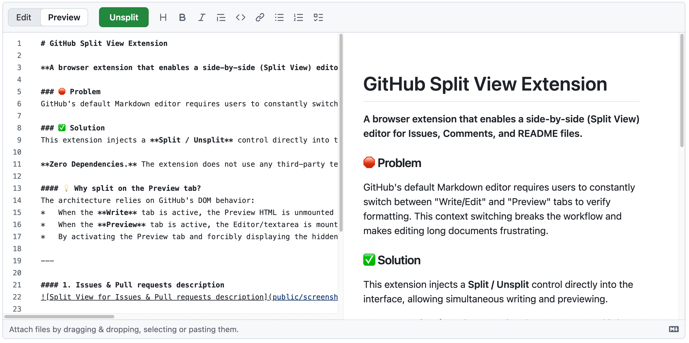

# GitHub Split View Extension

**A browser extension that enables a side-by-side (Split View) editor for Issues & Discussions & Pull Requests, Descriptions & Comments, and README files.**

### 🛑 Problem

GitHub's default Markdown editor requires users to constantly switch between "Write/Edit" and "Preview" tabs to verify formatting. This context switching breaks the workflow and makes editing long documents frustrating.

### ✅ Solution

This extension injects a **Split / Unsplit** control directly into the interface, allowing simultaneous writing and previewing.

**Zero Dependencies.** The extension does not use any third-party text editors. It leverages the native GitHub textarea and preview renderer.

#### 🎯 Supports:

- ✅ **Issue** description & comments
- ✅ **Pull Request** description & comments
- ✅ **Discussions** description & comments
- ✅ **README** files (and other markdown files)

#### 💡 Why split on the Preview tab?

The architecture relies on GitHub's DOM behavior:

- When the **Write** tab is active, the Preview HTML is unmounted (removed from DOM).
- When the **Preview** tab is active, the Editor/textarea is mounted but hidden via CSS.
- By activating the Preview tab and forcibly displaying the hidden Editor via CSS Grid, we achieve a dual view without complex state management or double-rendering.

---

#### Example

